# Background of Frontend

| Key                       | comment                                                          |
| ------------------------- | ---------------------------------------------------------------- |
| React                     | All code include tag are written in js file instead of html file |
| UI design                 | Tailwind CSS and DaisyUI. All style must be written in className |
| State Management          | React Redux                                                      |
| Routing                   | React-router-dom                                                 |
| Form validation           | Yup + react-hook-form: prevent XSS with frontend validation      |
| API                       | Axios                                                            |
| Payment Method            | PayPal                                                           |
| Other security Prevention | listed in ierg4210_server README.md                              |

## Website Interface

| Page / Component               | Interface                                                                     |
| ------------------------------ | ----------------------------------------------------------------------------- |
| Home Page                      | 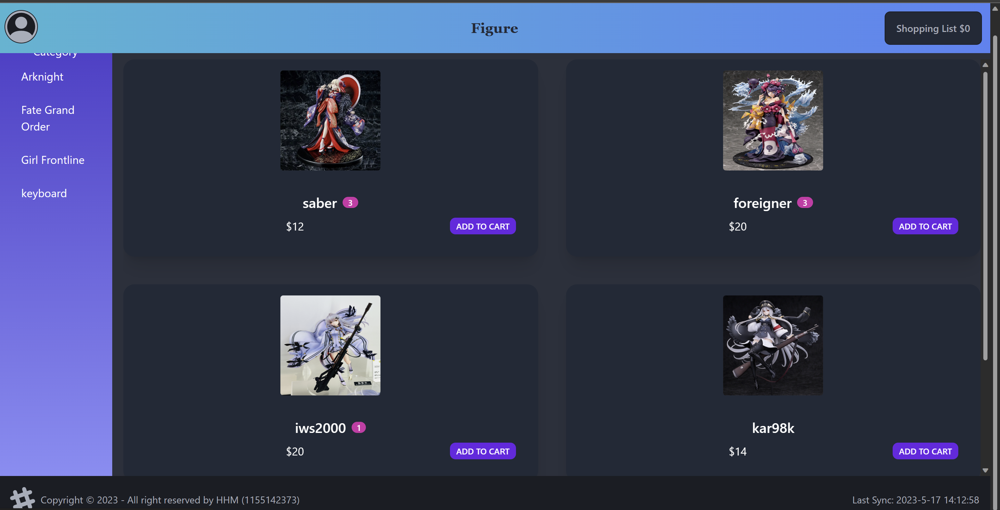                                              |
| Filter by Category             | 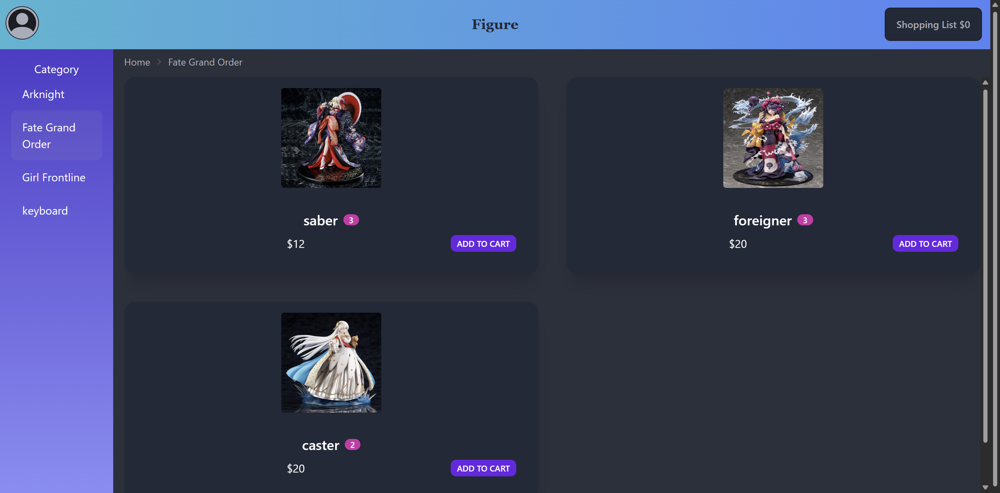                                          |
| Product Page                   | 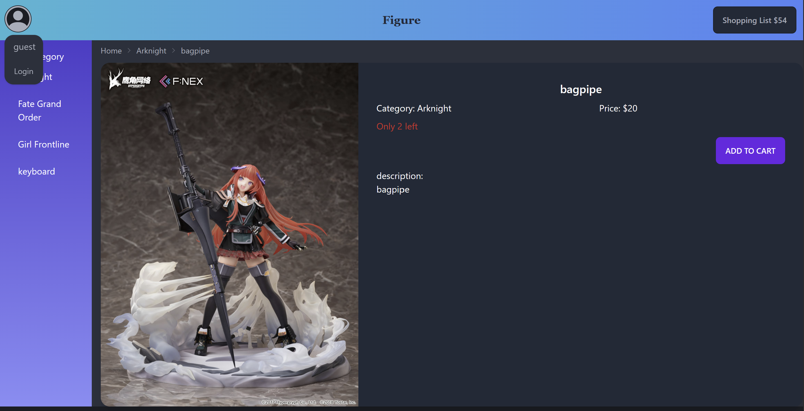                                           |
| Login Form                     | 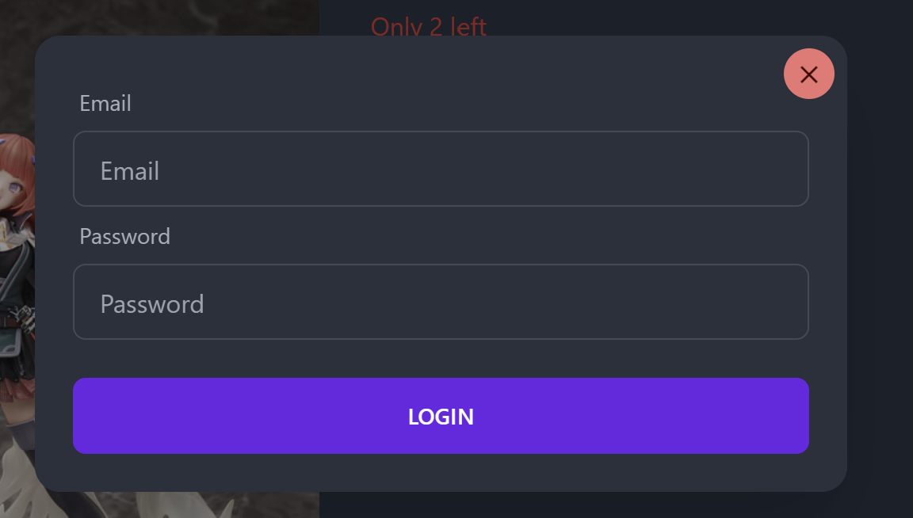                                             |
| Change Password Form           | 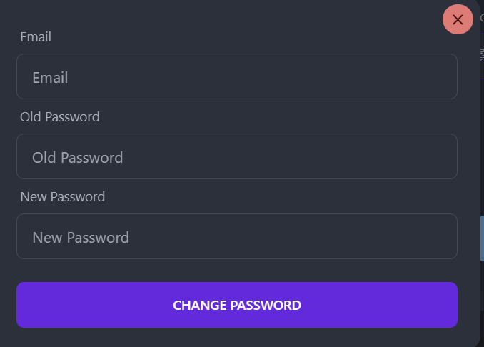                                         |
| Admin Page `(Admin)`           | 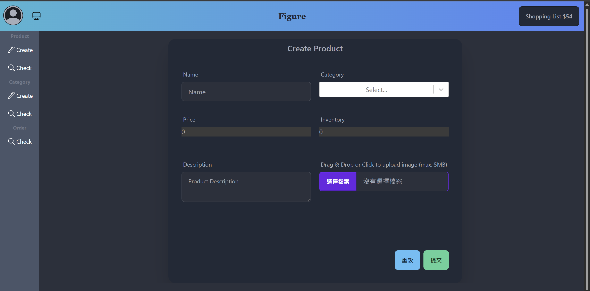                                       |
| Create Product Page `(Admin)`  | 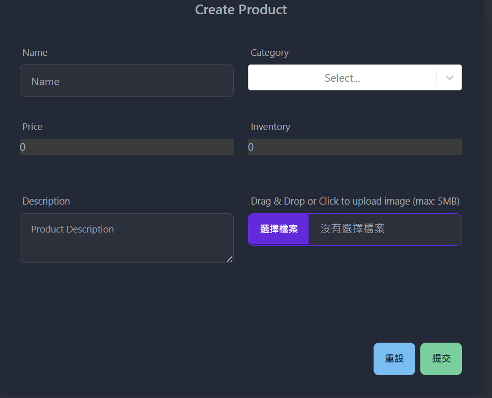                                    |
| Check Product Page `(Admin)`   | 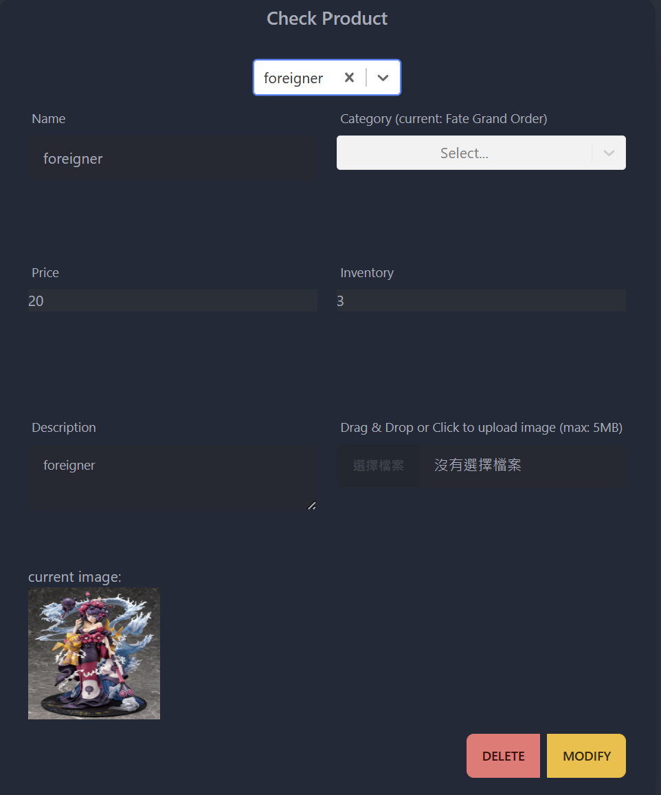                                     |
| Create Category Page `(Admin)` | 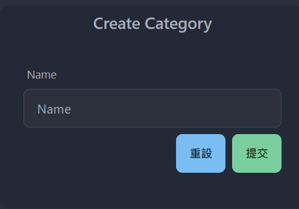                                   |
| Check Category Page `(Admin)`  | 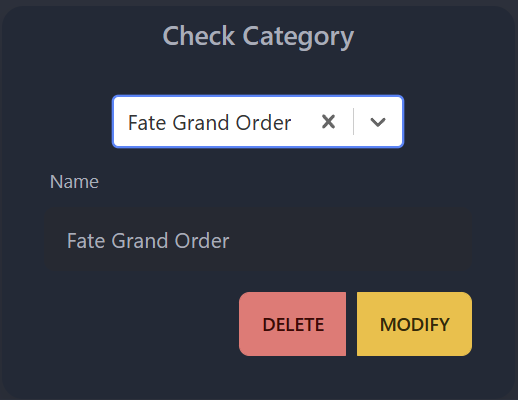                                    |
| Check Order Page `(Admin)`     | 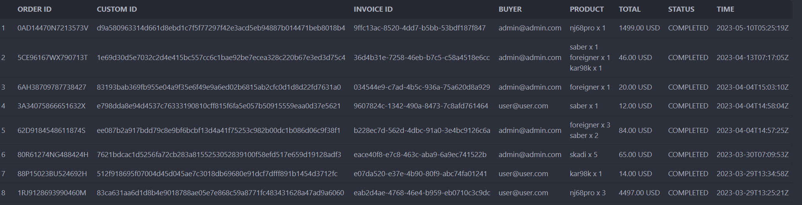                                       |
| Record Page                    | 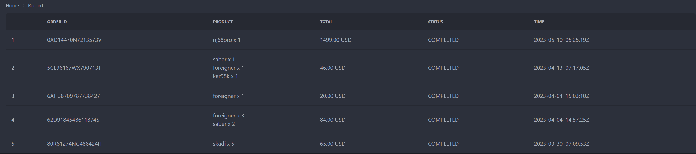                                       |
| Shopping Cart                  | 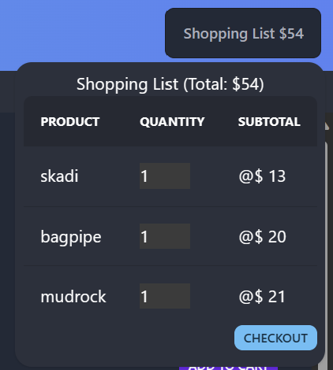 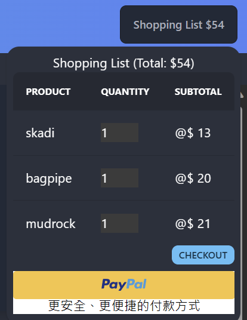 |

## Environment Management

In order to use different API for different environment(development, production), I have set up 2 .env file (under root directory directly):
|environment|Filename|
|----------|--------|
|development|`.env.development`|
|production|`.env.production`|

### Format:

| key                        |
| -------------------------- |
| React_App_API              |
| React_App_PayPal_Client_ID |

## How to Run the project's frontend

### Install Node.js (if not yet install)

Download from https://nodejs.org/en/. Version is 18.xx.x LTS (left button)

### `npm install`

Open terminal such as Powershell. Use `cd` command to arrive this folder (ierg4210). After reaching, please run `npm install` command to install all the dependencies.

### `npm start`

Runs the app in the development mode.\
Open [http://localhost:3000](http://localhost:3000) to view it in your browser.

The page will reload when you make changes.\
You may also see any lint errors in the console.

## Remainder of frontend

If using `npm start` to view the page, then in order to get data from DB, turning on backend server is necessary. Please visit ierg4210_server folder and read its README.MD to turn on the server.

If you want to not visit/visit admin panel, then please login in:
| email | password | role|
| ------ | ------ | ------ |
| admin@admin.com | admin | admin |
| user@user.com | user1234 | user |

All shopping cart items will be stored in redux instead of the local storage due to the framework.
